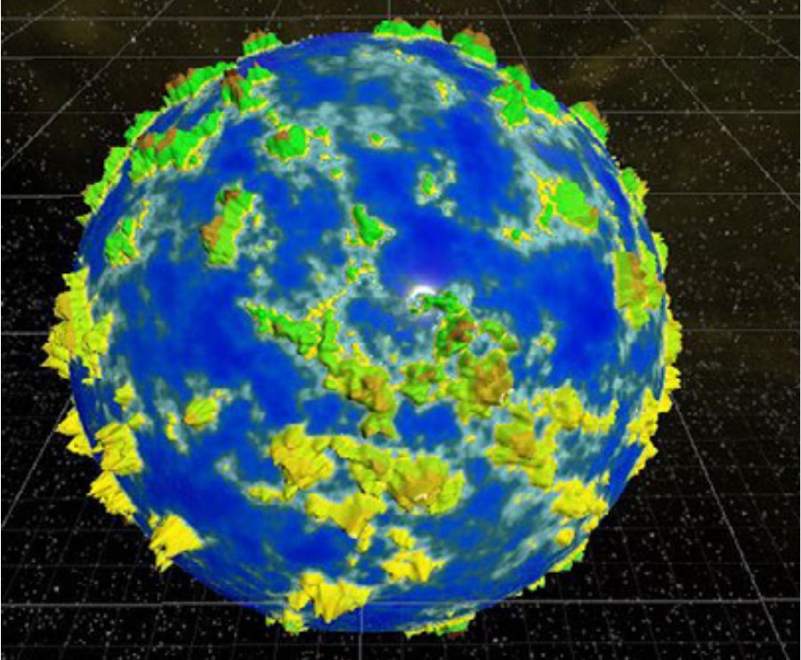

# Procedural Planet / Terrain Generator 🌍

**A small Unity project that generates procedural terrain/planets using Perlin noise, LOD meshes, and chunked "endless" terrain.**

---

## 📸 Screenshot



---

## 🚀 Overview

This repository contains a compact but fully functional procedural terrain generator built for Unity. It supports:

- Heightmap generation using layered Perlin noise (octaves, persistence, lacunarity)
- Falloff maps to shape islands/planets
- Color maps (terrain regions) based on height
- Mesh generation with adjustable height curves and LOD
- Background threading for map & mesh generation to keep the main thread responsive
- An editor inspector button to preview and regenerate
- An "Endless" chunked terrain system that creates and updates visible chunks based on the camera/viewer

---

## 🧭 Architecture & Key Components

### Top-level flow
1. `EndlessTerrain` tracks a viewer and manages visible chunks.
2. `TerrainChunk` requests `MapData` from `MapGenerator` when created.
3. `MapGenerator` generates a noise-based `heightMap` and `colorMap` (optionally applies a falloff map) on a background thread, then enqueues results back to the main thread.
4. `TerrainChunk` requests mesh data for a specific LOD. `MeshGenerator` builds `MeshData`, which gets applied to a `MeshFilter` when ready.
5. `MapDisplay` provides simple helpers to show a texture or mesh in the scene (useful for editor preview).

### Important scripts (brief)

- `Assets/Scripts/MapGenerator.cs` 🔧
  - Generates `MapData` (height and color maps).
  - Runs map- and mesh-generation requests on background threads and returns results via callbacks queued to the main thread.
  - Exposes editor preview options and settings (noise scale, octaves, persistence, lacunarity, falloff, seed, etc.).

- `Assets/Scripts/Noise.cs` 🌀
  - Implements multi-octave Perlin noise and offers local/global normalization.

- `Assets/Scripts/FallOffGenerator.cs` ⚠️
  - Creates a falloff map used to make islands/planets (note: see Known Issues below).

- `Assets/Scripts/TextureGenerator.cs` 🎨
  - Converts `heightMap`/`colorMap` into `Texture2D` for display or material use.

- `Assets/Scripts/MeshGenerator.cs` 🧱
  - Converts heightmap into a `MeshData` object with LOD (mesh simplification) and UVs.
  - `MeshData.CreateMesh()` produces a Unity `Mesh`.

- `Assets/Scripts/MapDisplay.cs` 🖼️
  - Helper for rendering a texture or mesh to a `Renderer` / `MeshFilter`.

- `Assets/Scripts/EndlessTerrain.cs` 🌐
  - Manages chunk creation and visibility using LOD rules. Uses `MapGenerator` and `TextureGenerator` to request map/mesh data.

- `Assets/Editor/MapGeneratorEditor.cs` 🛠️
  - Adds a small inspector UI for `MapGenerator` with an auto-update option and a "Generate" button.

---

## ⚙️ How to use

1. Open the project in Unity (recommended Unity 2019+).
2. Open `SampleScene` in `Assets/Scenes`.
3. Add `MapGenerator` (it may already be present in the scene).
4. Configure parameters in the inspector:
   - `Noise` settings: `scale`, `octaves`, `persistence`, `lacunarity`, and `seed`.
   - `Use Falloff` to enable island/planet shaping.
   - `meshHeightMultiplier` and `meshHeightCurve` adjust the terrain vertical profile.
   - `regions` define terrain colors per height.
5. Press **Generate** in the `MapGenerator` inspector to preview (or toggle `autoUpdate`).
6. For runtime, add a `viewer` transform to `EndlessTerrain` and run the scene to see chunked LOD streaming.

---

## 🔧 Notes about threading & performance

- Map and mesh generation run on worker threads to avoid blocking the main thread. Results are enqueued and applied during `Update()` on the main thread.
- LOD detail levels are defined in `EndlessTerrain` (`LODInfo[] detailsLevels`) and determine which mesh LOD is requested based on viewer distance.
- `MapGenerator.mapChunkSize` is **241** by default which is used across mesh/texture generation.

---

## ❗ Known issues & suggestions

- `Assets/Scripts/FallOffGenerator.cs` contains a couple of logic issues that will result in incorrect falloff maps:
  - The inner loop uses `for (int j = 0; i < size; j++)` — the condition should reference `j`.
  - The `Evaluate` method currently returns `Mathf.Pow(value, a) / Mathf.Pow(value, a) + Mathf.Pow(b - b * value, a);` which simplifies to `1 + ...` and is almost certainly not the intended formula. A typical falloff formula would be:

```csharp
map[j, i] = Evaluate(value);
...
static float Evaluate(float value) {
    float a = 3f;
    float b = 2.2f;
    return Mathf.Pow(value, a) / (Mathf.Pow(value, a) + Mathf.Pow(b - b * value, a));
}
```

- Consider clamping extreme parameter values in the editor or adding validation to make the generator more robust.

---

## 🧪 Testing / Tuning tips

- Start with low map chunk size and LODs when profiling or iterating.
- Use `Noise.NormalizeMode.Local` while tuning small maps; switch to `Global` for consistent world-scale results.
- Adjust `viewer` scale and `maxViewDist` in `EndlessTerrain` to control chunk density.

---

## 📁 Project structure

- `Assets/Scripts/` - core generator and supporting scripts
- `Assets/Editor/` - editor UI
- `Assets/Scenes/` - sample scene(s)
- `Docs/` - screenshots and documentation assets
- `LICENSE` - project license

---

## 🧰 Stack

- **C# / .NET 8**
- Unity (recommended 2019+)
- Unity Mesh & Texture APIs, ShaderLab

---

## 📎 Contributions

If you'd like to contribute improvements (bug fixes, optimizations, or features), please open an issue or a pull request. Small, focused PRs are easiest to review.

---

## 📄 License

This project includes a `LICENSE` file at the repo root — please refer to it for license details.

---

🔗 For high-resolution renders and more projects, visit my [Portfolio](https://data.sivagames.com/home).

Happy procedurally generating! ✨
